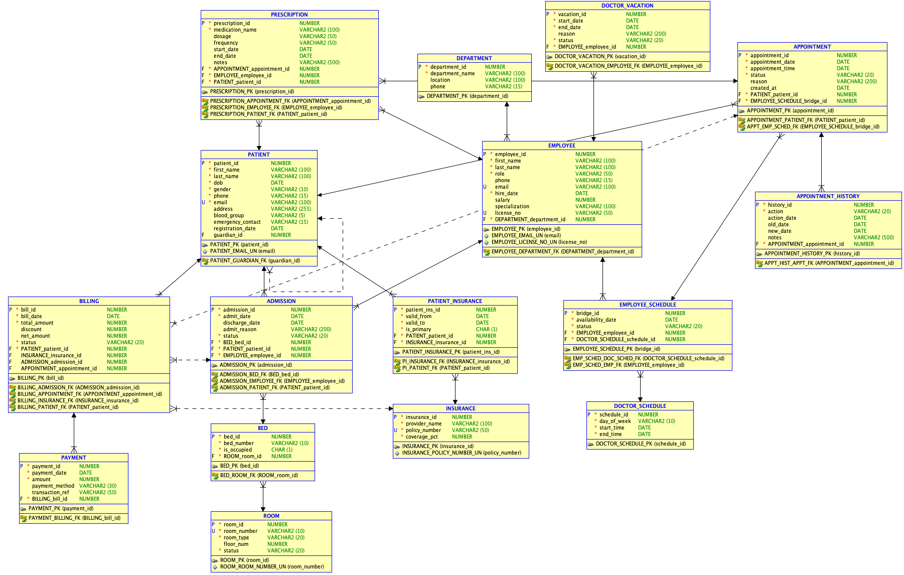

# Hospital Management System - DMDD 6210

## Project Overview
Centralized database for hospital operations covering:
- Patient Management (with self-referencing guardian)
- Employee Management (merged Doctor + Staff)
- Appointment Management (selected module for Part 2)
- Admission & Bed Management
- Billing & Payments with Insurance bridge table

## Database :

| Component | Count | Details |
|-----------|-------|---------|
| RDBMS | — | Oracle Autonomous Database (OCI) |
| Tables | 16 | Including 2 bridge tables |
| Foreign Keys | 22 | Referential integrity constraints |
| CHECK Constraints | 13 | Business rule validations |
| UNIQUE Constraints | 5 | Duplicate prevention |
| Sequences | 16 | One per table for PK generation |
| Stored Procedures | 5 | Business logic implementation |
| Triggers | 3 | Bed occupancy management (1 file) |
| Reports | 5 | Operational and analytical reports |
| Test Cases | 14 | All 14 passed  |

## ER Diagram :


## Bridge Tables :
- EMPLOYEE_SCHEDULE: Resolves M:N between Employee and Doctor_Schedule
- PATIENT_INSURANCE: Resolves M:N between Patient and Insurance

# Selected Module: Appointment Management
## Complete appointment booking flow:
```
╔══════════════════════════════════════════════════════════════╗
║           APPOINTMENT MANAGEMENT - BUSINESS FLOW             ║
║                  Hospital Management System                  ║
╚══════════════════════════════════════════════════════════════╝

┌─────────────┐
│   PATIENT   │
│ Registers   │
└──────┬──────┘
       │
       ▼
┌─────────────────────────────────────────┐
│         book_appointment()              │
│                                         │
│  Validation 1: Patient exists?          │
│  Validation 2: Slot AVAILABLE?          │
│  Validation 3: Employee is DOCTOR?      │
│  Validation 4: No duplicate booking?    │
│  Validation 5: Doctor not on vacation?  │
│  Validation 6: Doctor < 5 appts/day?    │
└──────────────────┬──────────────────────┘
                   │
         ┌─────────┴─────────┐
         │                   │
       FAIL               SUCCESS
         │                   │
         ▼                   ▼
   ┌───────────┐    ┌─────────────────────┐
   │ ORA-20xxx │    │ APPOINTMENT created │
   │  Error    │    │ status = SCHEDULED  │
   └───────────┘    │ EMPLOYEE_SCHEDULE   │
                    │ status = UNAVAILABLE│
                    │ HISTORY → CREATED   │
                    └──────────┬──────────┘
                               │
                    ┌──────────┴──────────┐
                    │                     │
                    ▼                     ▼
          ┌──────────────┐      ┌──────────────────┐
          │    CANCEL    │      │   RESCHEDULE     │
          │ appointment  │      │  appointment     │
          └──────┬───────┘      └────────┬─────────┘
                 │                       │
                 ▼                       ▼
    ┌────────────────────┐  ┌─────────────────────────┐
    │ cancel_appointment │  │ reschedule_appointment  │
    │                    │  │                         │
    │ Check: 24hr rule   │  │ Check: Not CANCELLED    │
    │ Check: Not already │  │ Check: New slot free    │
    │        CANCELLED   │  │ Check: Doctor available │
    │ Check: Not         │  │ Check: Not on vacation  │
    │        COMPLETED   │  │                         │
    └──────────┬─────────┘  └────────────┬────────────┘
               │                         │
               ▼                         ▼
    ┌─────────────────────┐  ┌──────────────────────────┐
    │ status = CANCELLED  │  │ status = RESCHEDULED     │
    │ Old slot → AVAILABLE│  │ Old slot → AVAILABLE     │
    │ HISTORY → CANCELLED │  │ New slot → UNAVAILABLE   │
    └─────────────────────┘  │ HISTORY → RESCHEDULED    │
                              └─────────────────────────┘
                                          │
                               ┌──────────┘
                               │
                               ▼
                    ┌─────────────────────┐
                    │  APPOINTMENT        │
                    │  COMPLETED          │
                    │  status = COMPLETED │
                    └──────────┬──────────┘
                               │
                    ┌──────────┴──────────┐
                    │                     │
                    ▼                     ▼
          ┌──────────────┐      ┌──────────────────┐
          │  OUTPATIENT  │      │    INPATIENT     │
          │ Consultation │      │  Needs Admission │
          └──────┬───────┘      └────────┬─────────┘
                 │                       │
                 ▼                       ▼
    ┌────────────────────┐  ┌─────────────────────────┐
    │  generate_bill()   │  │   admit_patient()       │
    │                    │  │                         │
    │ Lookup insurance   │  │ Check: Bed available    │
    │ Apply discount     │  │ Check: Doctor role      │
    │ Create BILL        │  │ Check: Not admitted     │
    │ status = PENDING   │  │ INSERT ADMISSION        │
    └──────────┬─────────┘  │ Trigger → BED occupied  │
               │            └────────────┬────────────┘
               ▼                         │
    ┌─────────────────────┐              ▼
    │    PAYMENT          │   ┌─────────────────────┐
    │  method: CASH/CARD/ │   │   ON DISCHARGE      │
    │  INSURANCE/CREDIT   │   │ Trigger → BED freed │
    └─────────────────────┘   │ generate_bill()     │
                              └─────────────────────┘
```
## Project Structure:
```
hospital-management-system/
│
├── Security/
│   ├── 01_roles_and_grants.sql      # Create users and roles
│   └── 02_operator_grants.sql       # Grant privileges after DDL
│
├── DDL/
│   ├── 01_create_tables.sql         # 16 tables with PKs
│   ├── 02_constraints.sql           # UNIQUE, CHECK, FK constraints
│   └── 03_sequences.sql             # 16 sequences for PK generation
│
├── DML/
│   ├── 01_insert_departments.sql    # 5 departments
│   ├── 02_insert_employees.sql      # 23 employees
│   ├── 03_insert_patients.sql       # 200 patients
│   ├── 04_insert_rooms_beds.sql     # 50 rooms, 75 beds
│   ├── 05_insert_insurance.sql      # 6 insurers, 100 links
│   ├── 06_insert_schedules.sql      # Doctor schedules
│   ├── 07_insert_appointments.sql   # 50 appointments
│   ├── 08_insert_admissions.sql     # 10 admissions + billing
│   ├── 09_insert_billing_payments.sql # Appointment billing
│   └── 10_Data_Load_Verification.sql  # PASS/FAIL verification
│
├── Procedures/
│   ├── 01_book_appointment.sql
│   ├── 02_cancel_appointment.sql
│   ├── 03_reschedule_appointment.sql
│   ├── 04_admit_patient.sql
│   └── 05_generate_bill.sql
│
├── Triggers/
│   └── 01_trg_occupied_bed.sql      # 3 bed management triggers
│
├── Reports/
│   ├── 01_daily_appointments.sql
│   ├── 02_doctor_schedule.sql
│   ├── 03_bed_occupancy.sql
│   ├── 04_revenue_report.sql
│   └── 05_cancellation_stats.sql
│
├── Tests/
│   └── test_cases.sql               # 14 test cases
│
└── run_all.sql                      # Master script
```

## How to Run :

### Option 1 — Run File by File :
1. Connect as ADMIN: Run `Security/01_roles_and_grants.sql`
2. Connect as hms_admin:
   - Run `DDL/01_create_tables.sql`
   - Run `DDL/02_constraints.sql`
   - Run `DDL/03_sequences.sql`
   - Run `DML/01` through `DML/10` in order
   - Run `Procedures/01` through `Procedures/05` in order
   - Run `Triggers/01_trg_occupied_bed.sql`
   - Run `Reports/01` through `Reports/05`
   - Run `Tests/test_cases.sql`
3. Connect as ADMIN: Run `Security/02_operator_grants.sql`

### Option 2 — Run All at Once :
1. Connect as ADMIN: Run `Security/01_roles_and_grants.sql`
2. Connect as hms_admin: Run `run_all.sql`
3. Connect as ADMIN: Run `Security/02_operator_grants.sql`

## Stored Procedures :
| # | Procedure | Description |
|---|-----------|-------------|
| 01 | book_appointment | Books appointment with 5 validations |
| 02 | cancel_appointment | Cancels with 24-hour rule |
| 03 | reschedule_appointment | Reschedules with slot management |
| 04 | admit_patient | Admits patient with doctor validation |
| 05 | generate_bill | Generates bill with insurance discount |

## Triggers :
| Trigger | Type | Description |
|---------|------|-------------|
| trg_occupied_bed | BEFORE INSERT | Blocks admission to occupied bed |
| trg_mark_bed_occupied | AFTER INSERT | Marks bed occupied after admission |
| trg_release_bed_on_discharge | AFTER UPDATE | Releases bed when patient discharged |

## Data Requirements :
- 200 Patients (180 adults + 20 minors with guardians)
- 23 Employees (15 Doctors + 5 Nurses + 3 Admin)
- 50 Appointments
- 10 Admissions (4 Active + 6 Discharged)
- 50 Rooms with 75 Beds
- 18 Bills + 14 Payments

## Users :
| User | Role | Access |
|------|------|--------|
| hmsdbadmin | Database Admin | Full system access — runs Security scripts |
| hms_admin | Schema Owner | Full DDL + DML — runs all project scripts |
| hms_operator | Operator | SELECT all tables + INSERT/UPDATE operational tables |

## Responsibilities :
| Name | Responsibility |
|------|---------------|
| Rijurik Saha | ER Diagram, DDL Script, Reports |
| Arundhati Kandelkar | Normalization, Procedures, Triggers, Test Cases |

## Team: Table Turners
```
Rijurik Saha        Arundhati Kandelkar
DMDD 6210 - Table Turners SEC Spring 2026
```


